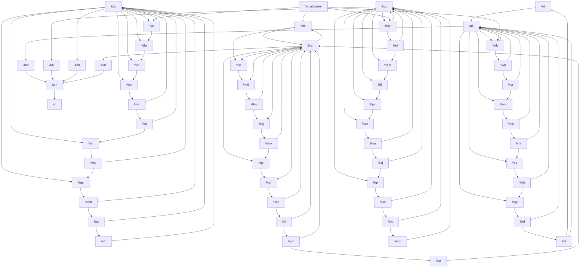

```mermaid
graph TD;
    zp[&zp]-->px;
    zp[&zp]-->gp;
    zp[&zp]-->cl;
    zp[&zp]-->bh;
    zp[&zp]-->fn;
    zp[&zp]-->ls;
    zp[&zp]-->hs;
    fn[%fn]-->px;
    br[%br]-->nx;
    br[%br]-->xf;
    lt[%lt]-->dj;
    mj[%mj]-->zp;
    mj[%mj]-->gp;
    fc[%fc]-->zp;
    gl[%gl]-->pr;
    gj[%gj]-->mx;
    kd[%kd]-->hq;
    vp[%vp]-->dj;
    vp[%vp]-->vr;
    px[%px]-->zx;
    pz[%pz]-->sr;
    pz[%pz]-->nx;
    hb[%hb]-->jl;
    hb[%hb]-->nx;
    sr[%sr]-->nx;
    zh[&zh]-->rx;
    bz[&bz]-->pm;
    bz[&bz]-->pc;
    bz[&bz]-->bv;
    bz[&bz]-->dl;
    bz[&bz]-->jp;
    bz[&bz]-->fj;
    bz[&bz]-->cc;
    xc[%xc]-->jc;
    xc[%xc]-->bz;
    md[%md]-->ts;
    md[%md]-->zp;
    mb[%mb]-->xx;
    jp[%jp]-->xc;
    hs[%hs]-->fn;
    ns[&ns]-->zh;
    xf[%xf]-->kd;
    gz[%gz]-->df;
    pm[%pm]-->fj;
    zx[%zx]-->zl;
    zx[%zx]-->zp;
    dc[%dc]-->dj;
    dc[%dc]-->vp;
    pc[%pc]-->cc;
    dj[&dj]-->lq;
    dj[&dj]-->mb;
    dj[&dj]-->dc;
    dj[&dj]-->ns;
    dj[&dj]-->gz;
    cl[%cl]-->mj;
    gp[%gp]-->md;
    xm[%xm]-->bz;
    nt[%nt]-->dj;
    nt[%nt]-->lq;
    jl[%jl]-->nx;
    jl[%jl]-->pz;
    ls[%ls]-->hs;
    ls[%ls]-->zp;
    zl[%zl]-->zp;
    zl[%zl]-->cl;
    cc[%cc]-->xp;
    xx[%xx]-->nt;
    xx[%xx]-->dj;
    nl[%nl]-->bz;
    nl[%nl]-->pm;
    hq[%hq]-->gj;
    hq[%hq]-->nx;
    dl[&dl]-->zh;
    ts[%ts]-->zp;
    ts[%ts]-->fc;
    nx[&nx]-->gl;
    nx[&nx]-->br;
    nx[&nx]-->pr;
    nx[&nx]-->xf;
    nx[&nx]-->vd;
    nx[&nx]-->gj;
    nx[&nx]-->kd;
    tf[%tf]-->lt;
    tf[%tf]-->dj;
    fj[%fj]-->pc;
    vr[%vr]-->dj;
    vr[%vr]-->mb;
    jc[%jc]-->bz;
    jc[%jc]-->xm;
    rb[%rb]-->gz;
    rb[%rb]-->dj;
    bh[&bh]-->zh;
    bv[%bv]-->bz;
    bv[%bv]-->nl;
    mx[%mx]-->gl;
    mx[%mx]-->nx;
    df[%df]-->dj;
    df[%df]-->tf;
    broadcaster[*broadcaster]-->ls;
    broadcaster[*broadcaster]-->bv;
    broadcaster[*broadcaster]-->dc;
    broadcaster[*broadcaster]-->br;
    vd[&vd]-->zh;
    bj[%bj]-->jp;
    bj[%bj]-->bz;
    xp[%xp]-->bz;
    xp[%xp]-->bj;
    pr[%pr]-->hb;
    lq[%lq]-->rb;
```
